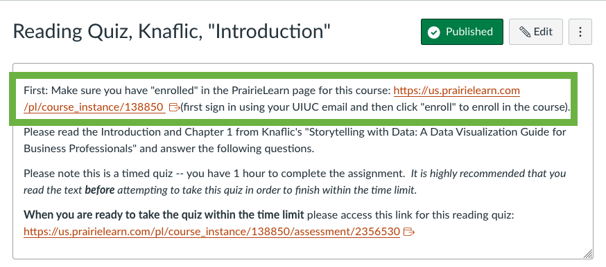

   
# Welcome to Data Storytelling, Day 2!

notes:
welcome back!

---

 
 
 

# A few more notes about quizzes

notes:
just a few more details about reading quizzes!

---

## Note 1 - You (typically) get 3 tries per question

(This might be updated for True/False questions)

notes:
right now its ~100%, 84%, 50% for each choice but we might update this for T/F questions since there are only true choices 

same with multi-check boxes, we might update this to give you more tries, but we might just leave as it to keep it simple.  

Stay tuned!

---

## Note 2 - Timed!

Each quiz has a *1 hour* time limit.

notes:
make sure you don't click on the link on Canvas until you are ready to take the quiz!

---

## Note 2 - Timed!

notes:
The link will be on Canvas like so with big bold letters telling you not to click until you are ready.

---

## Note 2 - Timed!

Full assessment list: https://us.prairielearn.com/pl/course_instance/138850

notes:
If you want to see the full list of assessments, you can always click on the main PL course link at the top of the first few quizzes OR on the main "home page" of canvas.

**stop for questions**

---

 
 
 

# Names Activity

---

## Naming activity & Introduction to Each Other

We'll first give you  ~2 minutes to write down some notes/data about "your" name.  Here "your" name can be your actual name, a nickname for you, the name of a pet, favorite place, etc.

Then we are going to break up into groups, where you'll chat with each other about your *name* (or the name of a place, 
person, animal, etc that is meaningful to you).

Talk a little about your name.  Does it mean something?  Where does it come from?

Afterward, we'll reconvene, allow for a few people to share a bit, and then we will break back out into our groups.

notes:
set some timers for these things!

---

## Names - Visualization

Now in your groups again, we want you to think about telling a story about names.

 * How do we tell a visual story about this?
 * What information -- *data* -- can we obtain about names?

We will break *back* into groups and share this, and sketch out a handful of ideas.
 
Questions?

notes:
**go through and then ask if folks have questions**

---

## Names - Visualization

In your new breakout rooms, we want you to think about telling a story about names.

 * How do we tell a visual story about this?
 * What information -- *data* -- can we obtain about names?

We will break *back* into groups and share this, and sketch out a handful of ideas.

A few things:
 1. one person in your group will need to be logged in to google through your @illinois.edu address
 2. only one person from the group should be accessing the jamboard -- there is a limit of 50 people per jamboard
 
**And go!** https://jamboard.google.com/d/1TX-2VdAE96SZPf8--Nd44OCuKh4H1V1eWMIgOC-Jd-4/edit?usp=sharing

notes:
**go through and then ask if folks have questions**
