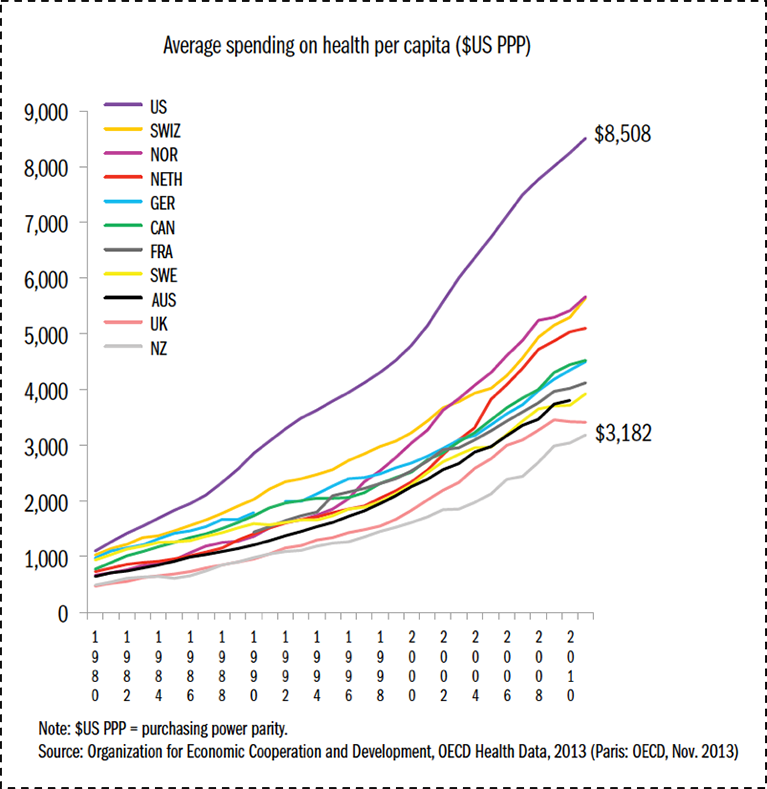
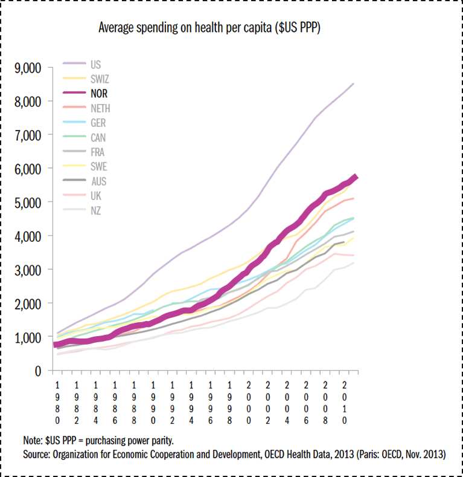
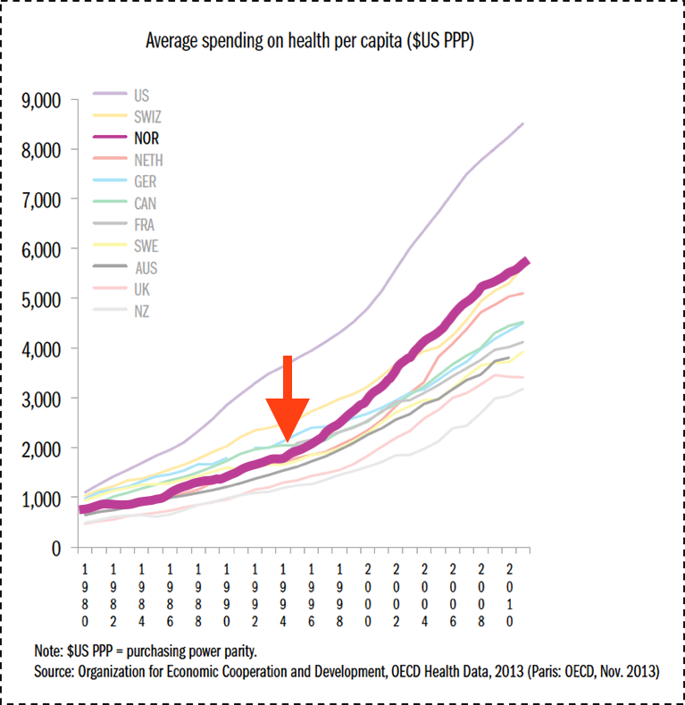
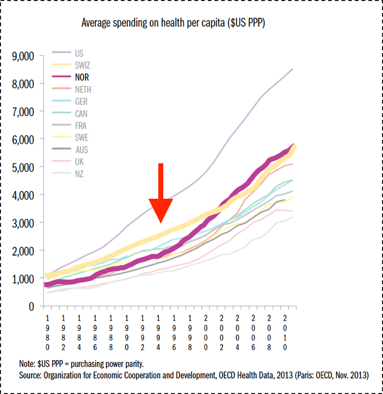

## Data Characters

 * Confidante
 * Dynamic
 * Flat
 * Foil
 * Round
 * Static
 * Stock

notes:
review -- last time we talked a bit about some data characters...

---

## Data Characters

 * **Confidante**
 * **Dynamic**
 * Flat
 * Foil
 * **Round**
 * **Static**
 * Stock

We will think of these in terms of their **predictability** and their
**complexity**.

notes:
specifically these four here...

---

## Data Characters

 * **Confidante**: someone in whom the central character confides, thus revealing the main character’s personality, thoughts, and intentions. The confidante does not need to be a person.
 * **Dynamic**: a character which changes during the course of a story or novel. The change in outlook or character is permanent. Sometimes a dynamic character is called a developing character.
 * Flat
 * Foil
 * **Round**: a well developed character who demonstrates varied and sometimes contradictory traits. Round characters are usually dynamic (change in some way over the course of a story).
 * **Static**: a character that remains primarily the same throughout a story or novel. Events in the story do not alter a static character’s outlook, personality, motivation, perception, habits, etc.
 * Stock

We will think of these in terms of their **predictability** and their
**complexity**.

(See e.g., [Ervin](http://www.fictionfactor.com/guests/common.html) )

notes:
and we gave these a few definitions

I cautioned here that these are a bit handwavy -- and for good reason!  

This types of mappings between data and storytelling definitions are actually an ongoing research with one of the other developers of the Data Storytelling class, Prof. Kate McDowell who really cautions us against direct mappings.

i.e. these concepts should really be used as a guide for your thinking.

However, we got some feedback that folks where worried about how they could make sure to "hit" this point on the grading rubric if the defintions are not well defined -- which is a fair question!  So, I'm just going to give a quick "good" and "bad" example of some data characters to illustrate what we are looking for here.

---

## EXAMPLE: Data Characters - Confidante

Revealing information through indirect information.  Patterns or information
casting "shadows" that reveal the original.

 <!-- .slide: data-background-image="../week10/images/confidante1.svg" data-background-size="contain" --> 
 
notes:
as an example, let's remember our "confidante" 

here we see a draw the data and we see a pattern in the data 

---

## EXAMPLE: Data Characters - Confidante

Revealing information through indirect information.  Patterns or information
casting "shadows" that reveal the original.

 <!-- .slide: data-background-image="../week10/images/confidante2.svg" data-background-size="contain" --> 

notes:
maybe we plot another data line from a similar source and see a very similar pattern -- this is a "shadow" of the original data that is "confiding" in us that there is a pattern

---

## EXAMPLE: Data Characters - Confidante

Example story: Healthcare system in Norway

notes:
Let's say I am telling a story about the healthcare system in Norway and I want to discuss how policies affect the cost per person...

---

## EXAMPLE: Data Characters - Confidante

Example story: Healthcare system in Norway

notes:
So I show you this slide and say something along the lines of "as we can see, the healthcare per person has grown over time but not as significantly as in a place like the US, but significantly when new policies were inacted in the mid-1990's

But this slide is very hard to parse!  What are the interesting patterns that might be hidden here? (i.e. the "confidant")?

There are a lot of problems -- there are a lot of lines on this plot, and there are man colors that look the same -- how easy is it to pick out NOR vs. UK vs NETH colors?

How much are we assuming from our audience about how much they know about these country abbrievations?

---

## EXAMPLE: Data Characters - Confidante

Example story: Healthcare system in Norway

* Modification \#1: Light opacity boxes around all but NOR
* Modification \#2: Take out distracting text
* Modification \#3: Highlight the trend line in bold (obviously, you should do a better job!)

notes:
So I've now made a few modifications... **read** 

Now we are able to focus on the change in norway specifically

---

## EXAMPLE: Data Characters - Confidante

Example story: Healthcare system in Norway

* Modification \#4: Arrow to date of policy change

notes:
I could even put an arrow specifcying the date of the policy change -- this really defines that this pattern holds an interesting story -- the "confidante" in this case could be thought of as the policy change, i.e. it is hold the "secrets" of this abrupt change in healthcare spending (but again, hand wavy!)

---

## EXAMPLE: Data Characters - Confidante

Example story: Healthcare system in Norway

* Modification \#5: Highlight another country

notes:
Or maybe the real story here is that another country, like Switzerland had a very similar healthcare system to Norway after their policy change and so it makes sense that norway and switzerland had very differnt costs before the switch but after the policy change (after a few years lag for the full implementation to take place) their costs then started to look very similar

In this case the "hidden" part of the story is the comparision between Switzerland and Norway

**again -- this is all very handwavy!** but hopefully that gives you some ideas for "well described" vs "not well described" data characters (at least, in this example) as it relates to plots.

---

## Cautions

* It can be easy to mislead viewers -- make sure you can back up these statements with peer reviewed research!
* Take care overdrawing lines -- ideally you have access to data (you can extract pixel-level precision data points manually with online tools)

